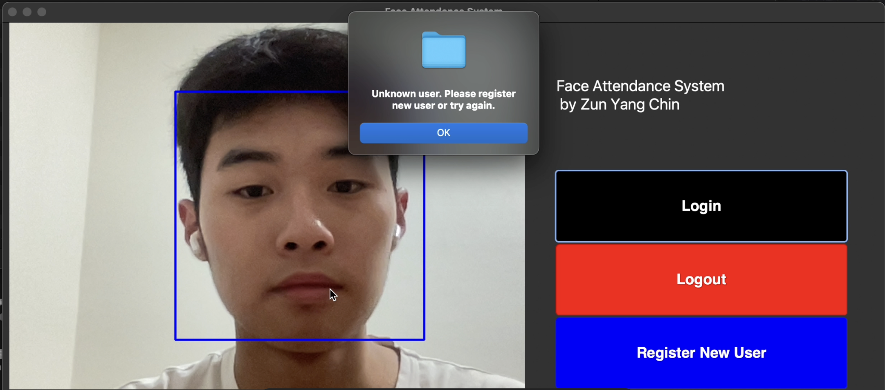
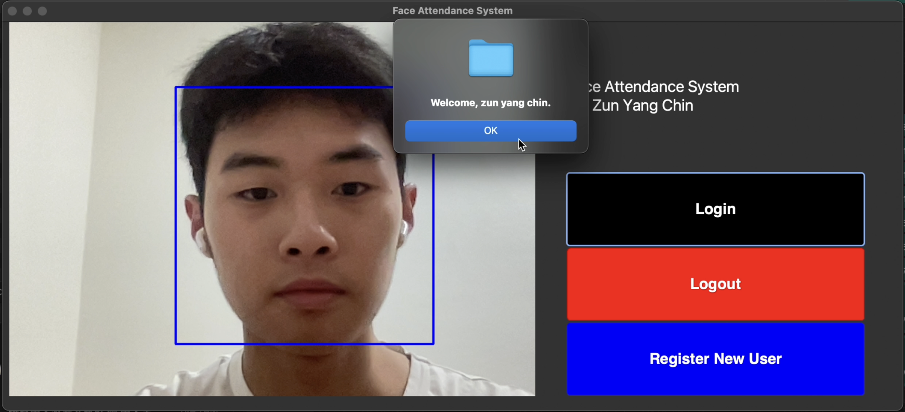
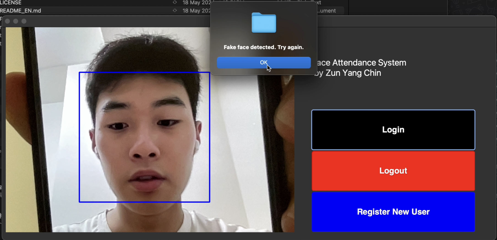
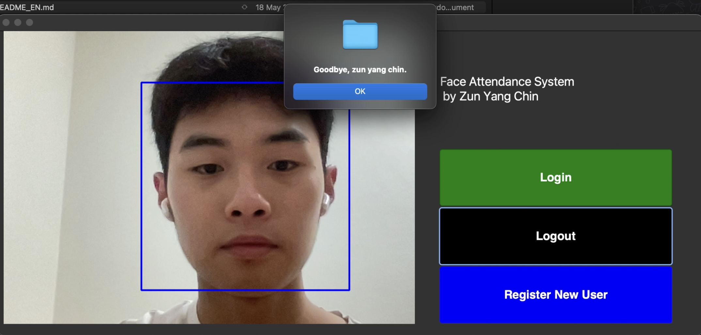
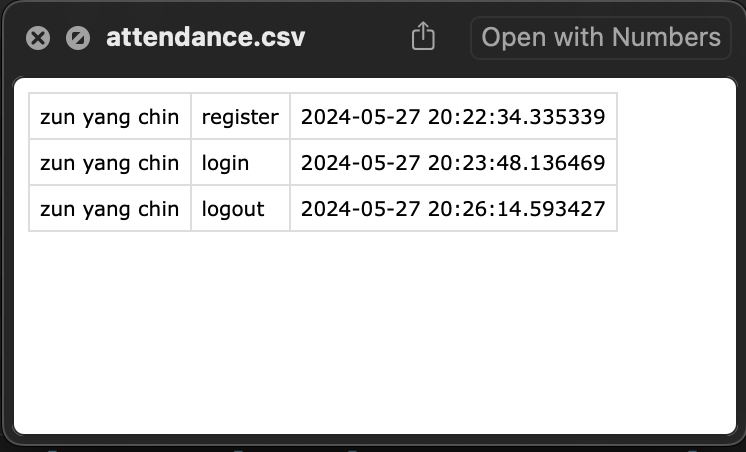

# Face Attendance System with Liveness Detection
## Overview
This project presents a comprehensive exploration and comparison of two distinct approaches to building a face recognition application: face verification (self-supervised learning) and face classification (supervised learning). The system integrates the best-performing model into a face attendance system with an anti-spoofing module to ensure security and reliability.

## Files and Their Descriptions
1. `102781103_FASProjectReport.pdf`
This PDF file contains the detailed project report, which includes the introduction, methodology, results, discussion, and conclusion. It provides an in-depth analysis of the face recognition models developed and their performance.

2. `classification_vgg_model.ipynb`
This Jupyter notebook contains the implementation of the VGG-based face classification model. It includes data preprocessing, model training, evaluation, and saving of the model. The VGG model is used to classify faces into predefined identity classes.

3. `verification_siamese_model.ipynb`
This Jupyter notebook includes the implementation of the Siamese network for face verification. It involves data collection using a webcam, model architecture definition, training, and evaluation. The Siamese model determines whether two face images belong to the same person.

4. `face_attendance_app.ipynb`
This Jupyter notebook documents the process of building the face attendance application using the trained Siamese model. It includes steps for loading the model, preprocessing images, verifying faces, logging events, and creating the user interface with Tkinter. The application integrates real-time webcam functionality and an anti-spoofing module.

## Application Interface

## Downloading Pre-trained Models
Pre-trained models and other resources must be downloaded and placed in the same directory. Ensure you have the following models and datasets downloaded:
1. [Download Kaggle Face Dataset]([url](https://www.kaggle.com/competitions/11-785-fall-20-homework-2-part-2/data))
2. [Download `deploy.txt` & `res10_300x300_ssd_iter_140000.caffemodel`]([url](https://github.com/Shiva486/facial_recognition))
3. [Download VGG face weights]([url](https://www.kaggle.com/datasets/acharyarupak391/vggfaceweights))
4. [Download Pre-trained antispoofing model]([url](https://github.com/minivision-ai/Silent-Face-Anti-Spoofing/tree/master))

## Create the following directories as data store
root/
  |__`face_attendance_app.ipynb`
  |__...other notebooks
  |__unzipped dataset
  |__...other pre-trained models
  |__siamese_app_data/
      |__input_images/
      |__verification_images_app/
      |__`attendance.csv`

If you would like to contribute to this project, please fork the repository and submit a pull request. For any issues or suggestions, please open an issue on GitHub or contact me via [email](zunyangzy03@gmail.com).
